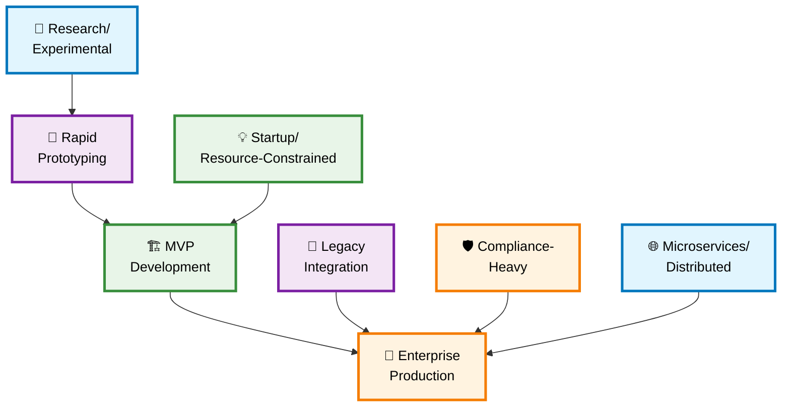

# 🎯 Prompt Engineering Scenarios

<div align="center">

[](https://github.com/VIKAS9793/prompt-engineering-scenarios/stargazers)
[](https://opensource.org/licenses/MIT)
[](http://makeapullrequest.com)
[](https://github.com/VIKAS9793/prompt-engineering-scenarios/issues)
[](https://github.com/VIKAS9793/prompt-engineering-scenarios/discussions)

**A comprehensive collection of scenario-based prompts for AI-assisted development**

*Generate code and solutions tailored to specific development contexts, from rapid prototyping to enterprise production systems*

[🚀 Quick Start](#-quick-start) • [📊 Decision Matrix](#-decision-matrix) • [🎯 See Results](#-community-showcase) • [📚 Documentation](#-documentation) • [🤝 Contributing](#-contributing)

</div>

---

## ✨ Features

<table>
<tr>
<td width="50%">

### 🎯 **Context-Aware Development**
- Scenario-specific prompt templates
- AI-optimized code generation
- Production-ready solutions
- Best practices built-in

</td>
<td width="50%">

### 🔄 **CVP+ARL Methodology**
- Cognitive Verifier Pattern
- Auto-Refinement Loop
- Step-by-step verification
- Quality-assured outputs

</td>
</tr>
</table>

---

## 🚀 Quick Start

```bash
# 1. Clone the repository
git clone https://github.com/VIKAS9793/prompt-engineering-scenarios.git

# 2. Navigate to prompts directory
cd prompt-engineering-scenarios/prompts/

# 3. Choose your scenario and copy the prompt
# 4. Paste into your AI coding assistant
# 5. Follow the structured development process
```

<div align="center">

### 🎮 **Your Development Journey**

| Step | Action | Expected Outcome |
|------|--------|-----------------|
| 1️⃣ | **Identify** your development context | Clear project requirements |
| 2️⃣ | **Select** appropriate scenario prompt | Matched development approach |
| 3️⃣ | **Generate** AI-assisted solution | Structured, context-aware code |
| 4️⃣ | **Iterate** using built-in refinement | Production-ready implementation |

</div>

---

## 🎯 Community Showcase

<div align="center">

### 🌟 **Real Results from Real Developers**

*Help us build credibility by sharing your experience!*

</div>

> **📢 We're Building Evidence Together**  
> This project's strength comes from developers like you sharing real results. Every success story, screenshot, and improvement suggestion helps validate these prompts for the entire community.

### 🤝 Share Your Success Story

**📝 Have you used our prompts?** Help others by sharing:

<div align="center">

| 📊 **What to Share** | 🎯 **How It Helps** |
|---------------------|-------------------|
| Before/after code snippets | Shows concrete improvements |
| Development time saved | Demonstrates efficiency gains |
| Unexpected benefits discovered | Reveals hidden value |
| Challenges faced and solutions | Helps others avoid pitfalls |
| Screenshots of working apps | Provides visual validation |

[📝 Share Your Story](https://github.com/VIKAS9793/prompt-engineering-scenarios/discussions/new?category=success-stories) • [📸 Submit Screenshots](https://github.com/VIKAS9793/prompt-engineering-scenarios/issues/new?template=showcase.md) • [💬 Join Discussion](https://github.com/VIKAS9793/prompt-engineering-scenarios/discussions)

</div>

### 📈 Community Validation Program

We're actively collecting evidence of prompt effectiveness:

- **📊 Efficiency Tracking**: Share your development time comparisons
- **🔍 Code Quality Reports**: Submit before/after analyses
- **📱 Working Examples**: Showcase applications built with our prompts
- **🧪 A/B Test Results**: Compare prompt-generated vs traditional code

**🏆 Recognition Program**: Contributors to our validation program will be featured in our Hall of Fame with proper attribution.

---

## 📊 Decision Matrix

<div align="center">

### 🎯 **Find Your Perfect Scenario**

*Each scenario is tested and refined by community feedback*

</div>

| 🎪 **Scenario** | 🎯 **Best For** | ⏱️ **Time Frame** | 👥 **Team Size** | 💡 **Example Use Case** |
|:---|:---|:---:|:---:|:---|
| **🚀 Rapid Prototyping** | Proving concepts, demos | 1-3 days | 1-2 devs | Building a chatbot demo for stakeholders |
| **🏗️ MVP Development** | First user-facing version | 2-8 weeks | 2-5 devs | Marketplace with core buying/selling features |
| **🏢 Enterprise Production** | Mission-critical systems | 3-12 months | 5+ devs | Banking transaction processing engine |
| **🔗 Legacy Integration** | Connecting old/new systems | 4-16 weeks | 3-6 devs | Adding cloud analytics to on-prem ERP |
| **💡 Startup/Resource-Constrained** | Limited time/budget | 2-6 weeks | 1-3 devs | Building SaaS tool with 2-month runway |
| **🛡️ Compliance-Heavy** | Regulated industries | 6-18 months | 4-8 devs | Healthcare patient portal (HIPAA compliant) |
| **🔬 Research/Experimental** | Testing hypotheses | 1-8 weeks | 1-4 devs | Validating new ML model architecture |
| **🌐 Microservices/Distributed** | Large-scale systems | 6-24 months | 8+ devs | Global e-commerce platform |
| **🤖 AI/ML Integration** | Machine learning systems | 4-12 months | 3-6 devs | Deploying ML models to production |
| **🛠️ DevOps/Infrastructure** | Cloud infrastructure | 1-6 months | 2-5 devs | Setting up CI/CD pipelines |
| **⚡ Performance Optimization** | System optimization | 2-8 weeks | 1-3 devs | Improving application performance |
| **🔌 API-First** | API development | 2-6 weeks | 1-4 devs | Building developer-friendly APIs |
| **📱 Mobile-Native** | iOS/Android apps | 3-9 months | 2-6 devs | Building platform-specific mobile apps |
| **🔒 Security-First** | Security-critical apps | 3-12 months | 3-6 devs | Applications handling sensitive data |
| **⏱️ Real-Time Systems** | Low-latency apps | 2-6 months | 2-5 devs | Chat, gaming, or IoT applications |
| **🔄 Cross-Platform** | Multi-platform apps | 2-6 months | 2-4 devs | Apps for web, mobile, and desktop |
| **📊 Data Engineering** | Data pipelines | 1-6 months | 2-5 devs | Building ETL/ELT processes |
| **🌍 Open Source** | Community projects | Ongoing | 1+ maintainers | Maintaining open source projects |

---

## 🔧 Prompt Efficiency Deep Dive

<div align="center">

### 🚀 **Why CVP+ARL Makes a Difference**

</div>

### 📊 Efficiency Factors

<table>
<tr>
<td width="50%">

#### ⚡ **Structured Generation**
```
Traditional Prompt:
"Build me a REST API"

CVP+ARL Prompt:
1. ✅ Context understanding
2. ✅ Constraint identification  
3. ✅ Architecture planning
4. ✅ Implementation generation
5. ✅ Quality verification
6. ✅ Auto-refinement
```

</td>
<td width="50%">

#### 🎯 **Quality Improvements**
```
Without CVP+ARL:
• Generic solutions
• Missing edge cases
• Inconsistent quality
• Manual verification needed

With CVP+ARL:
• Context-aware solutions
• Built-in error handling
• Consistent structure
• Self-verifying output
```

</td>
</tr>
</table>

### 📈 Help Us Measure Real Impact

**🔬 We're Collecting Anonymous Usage Data:**

- Development time before/after using prompts
- Code quality improvements (bugs, maintainability)
- Team productivity changes
- Successful deployments to production

**📝 Contribute Your Metrics:**
- [Share Development Time Comparison](https://github.com/VIKAS9793/prompt-engineering-scenarios/discussions/categories/metrics)
- [Report Code Quality Improvements](https://github.com/VIKAS9793/prompt-engineering-scenarios/discussions/categories/quality)
- [Submit Project Success Stories](https://github.com/VIKAS9793/prompt-engineering-scenarios/discussions/categories/success-stories)

---

## 🔄 Project Evolution Paths

<div align="center">

### 📈 **How Projects Naturally Progress**

</div>



<div align="center">

**💡 Pro Tip:** Most projects start simple and evolve. Choose your current needs, not your future dreams!

</div>

---

## 🔧 Core Methodology: CVP+ARL

<div align="center">

### 🧠 **Cognitive Verifier Pattern + Auto-Refinement Loop**

</div>

<table>
<tr>
<td width="50%">

#### 🔍 **Verification Phase**
```
1. 📝 Restatement
   ↳ Clarify problem context
   
2. 📋 Constraints Analysis
   ↳ Identify limitations
   
3. 🏗️ Solution Architecture
   ↳ Plan systematically
   
4. 💻 Implementation
   ↳ Write structured code
```

</td>
<td width="50%">

#### 🔄 **Refinement Phase**
```
5. ✅ Verification Checks
   ↳ Multi-layer validation
   
6. 🔧 Auto-Refinement
   ↳ Iterate until perfect
   
7. 🎯 Quality Assurance
   ↳ Production-ready output
   
8. 📊 Confidence Rating
   ↳ Quantified reliability
```

</td>
</tr>
</table>

---

## 🎯 Complete Scenario Catalog

### Core Development Scenarios
- [🚀 Rapid Prototyping](prompts/rapid-prototyping.md) - Quickly validate ideas with minimal code
- [🏗️ MVP Development](prompts/mvp-development.md) - Build your first user-facing version
- [🏢 Enterprise Production](prompts/enterprise-production.md) - Mission-critical system development
- [🔗 Legacy Integration](prompts/legacy-integration.md) - Connect modern and legacy systems
- [💡 Startup/Resource-Constrained](prompts/startup-constrained.md) - Build with limited resources
- [🛡️ Compliance-Heavy](prompts/compliance-heavy.md) - Develop for regulated industries
- [🔬 Research/Experimental](prompts/research-experimental.md) - Experimental and research projects
- [🌐 Microservices/Distributed](prompts/microservices-distributed.md) - Distributed system architecture

### Specialized Scenarios
- [🤖 AI/ML Integration](prompts/ai-ml-integration.md) - Machine learning model deployment
- [🛠️ DevOps/Infrastructure](prompts/devops-infrastructure.md) - Cloud and infrastructure as code
- [⚡ Performance Optimization](prompts/performance-optimization.md) - System and code optimization
- [🔌 API-First Development](prompts/api-first-development.md) - Design-first API development
- [📱 Mobile-Native](prompts/mobile-native-development.md) - Native mobile app development
- [🔒 Security-First](prompts/security-first-development.md) - Security-focused development
- [⏱️ Real-Time Systems](prompts/real-time-systems.md) - Low-latency applications
- [📊 Data Engineering](prompts/data-engineering.md) - Data pipelines and ETL processes
- [📋 Audit Preparation](prompts/audit-preparation.md) - Preparing for technical audits
- [🌍 Open Source](prompts/open-source-maintenance.md) - Open source project maintenance

---

## 🎯 Example Outputs

<div align="center">

### 💡 **See the Prompts in Action**

Here's an example of using our Rapid Prototyping prompt with Claude Code AI:

#### 1. Prompt Input


#### 2. Example Output
.png)

#### 3. Code Implementation
.png)

</div>

## 🚀 Getting Started with Examples

<div align="center">

### 💡 **How to Use These Prompts**

</div>

Each prompt in this repository follows a structured format to help you get the best results:

1. **Role & Expertise** - Understand the AI's perspective
2. **Core Behaviors** - Key focus areas for the AI
3. **Process** - Step-by-step guidance
4. **Verification** - Checklist to validate results
5. **Related Scenarios** - Connect with other relevant prompts

### 🔄 From Prompt to Production

**Step-by-Step Process:**

1. **Choose Your Scenario** (5 minutes)
   - Use our decision matrix
   - Consider your timeline and constraints

2. **Customize the Prompt** (10 minutes)
   - Replace placeholders with your specific context
   - Add any technology constraints

3. **Run Initial Generation** (15-30 minutes)
   - Paste full prompt into your AI assistant
   - Let CVP+ARL complete all phases

4. **Iterate & Refine** (30-60 minutes)
   - Use verification feedback for improvements
   - Test generated code incrementally

5. **Production Readiness** (varies by scenario)
   - Follow scenario-specific deployment guides
   - Implement monitoring and error handling

### 🛡️ Best Practices

- Always run the verification phase completely
- Test in development before production
- Keep prompts updated with your learnings
- **Share improvements back to the community**

---

## 📚 Documentation & Resources

<div align="center">

### 📖 **Getting Started**

</div>

For detailed guidance and the latest updates:
- 📝 Check our [Wiki](https://github.com/VIKAS9793/prompt-engineering-scenarios/wiki) for tutorials
- 💬 Join [Discussions](https://github.com/VIKAS9793/prompt-engineering-scenarios/discussions) for community support
- 🐛 Report issues or suggest improvements in [Issues](https://github.com/VIKAS9793/prompt-engineering-scenarios/issues)
- 📈 Track project updates in [Releases](https://github.com/VIKAS9793/prompt-engineering-scenarios/releases)

---

## 🤝 Contributing

<div align="center">

### 🚀 **Join Our Evidence-Based Community**

We're building the most credible prompt engineering resource through authentic community contributions.

[📖 Contribution Guidelines](CONTRIBUTING.md) • [🐛 Report Issues](https://github.com/VIKAS9793/prompt-engineering-scenarios/issues) • [💡 Request Features](https://github.com/VIKAS9793/prompt-engineering-scenarios/issues/new) • [💬 Discuss Ideas](https://github.com/VIKAS9793/prompt-engineering-scenarios/discussions)

</div>

### 🌟 How Your Contribution Matters

- **Build credibility** through real-world validation
- **Help peers** make informed decisions about AI tools
- **Shape the future** of prompt engineering practices
- **Gain recognition** in a growing technical community

### 💡 Contribution Opportunities

<table>
<tr>
<td width="50%">

#### 📊 **Validation Contributions**
- ✅ Share real development time comparisons
- 📸 Submit screenshots of working applications
- 📈 Provide before/after code quality metrics
- 🧪 Document A/B testing results
- 💬 Write detailed use case studies

</td>
<td width="50%">

#### 🛠️ **Technical Contributions**
- ➕ Add new scenario prompts
- 🔧 Improve existing prompt effectiveness
- 📝 Fix documentation or add examples
- 🌍 Translate prompts to other languages
- 🔍 Report and fix prompt issues

</td>
</tr>
</table>

### 📈 Community Evidence Standards

We maintain high standards for community contributions:

- **Real Examples Only**: No hypothetical or fabricated results
- **Verifiable Claims**: Screenshots, code snippets, or measurable outcomes
- **Constructive Feedback**: Both positive results and improvement suggestions
- **Attribution**: Proper credit for all contributors and sources
- **Transparency**: Clear methodology for any shared metrics

### 🏆 Recognition & Attribution

- **Success Stories**: Featured in README with attribution
- **Code Contributors**: Listed in CONTRIBUTORS.md
- **Community Moderators**: Special recognition badges
- **Documentation Authors**: Individual page attribution

---

## 📊 Repository Status & Transparency

<div align="center">


**📊 Project Metrics**: All statistics are community-contributed and verifiable through our discussions and issues.

</div>

---

## ⭐ Support This Project

<div align="center">

### 🤝 **Help Us Build Credible AI Development Resources**

Your authentic contributions validate this resource for the entire developer community.

[](https://github.com/VIKAS9793/prompt-engineering-scenarios)
[](https://github.com/VIKAS9793/prompt-engineering-scenarios/discussions/new?category=success-stories)
[](https://github.com/VIKAS9793/prompt-engineering-scenarios/discussions/categories/metrics)
[](https://github.com/VIKAS9793/prompt-engineering-scenarios/discussions)

</div>

---

<div align="center">

### 🔗 **Quick Navigation**

[🏠 Home](#-prompt-engineering-scenarios) • [🚀 Quick Start](#-quick-start) • [🎯 Community Showcase](#-community-showcase) • [📊 Decision Matrix](#-decision-matrix) • [🤝 Contributing](#-contributing)

---

### 👨‍💻 Author

**VIKAS SAHANI**  
📧 [vikassahani17@gmail.com](mailto:vikassahani17@gmail.com)  
🔗 [LinkedIn Profile](https://www.linkedin.com/in/vikas-sahani-727420358)

<sub>Building evidence-based AI development resources with the community ❤️</sub>

</div>