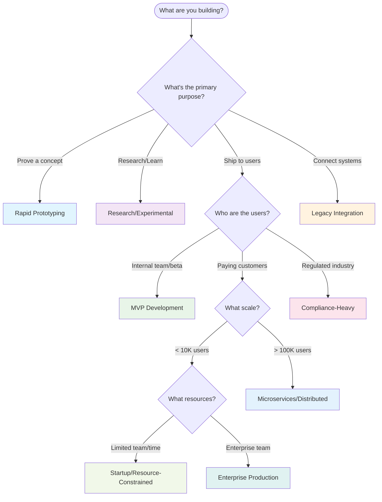

# Decision Tree: Choosing the Right Prompt

This guide helps you select the optimal prompt for your specific development context.

## 🎯 Quick Decision Flowchart



## 📊 Detailed Decision Matrix

### Context Questions
Answer these questions to identify your scenario:

| Question | Answer Options | Points Toward |
|----------|----------------|----------------|
| Timeline | Hours/Days | Rapid Prototyping |
|          | Weeks | MVP Development, Startup |
|          | Months | Enterprise Production |
|          | Flexible | Research/Experimental |
| Users | Internal only | Rapid Prototyping |
|        | Beta testers | MVP Development |
|        | Paying customers | Enterprise Production |
|        | Researchers | Research/Experimental |
| Failure Impact | Demo doesn't work | Rapid Prototyping |
|                 | Some users frustrated | MVP Development |
|                 | Business/reputation damage | Enterprise Production |
|                 | Invalid research | Research/Experimental |
| Team Size | 1-2 people | Rapid Prototyping, Startup |
|           | 3-5 people | MVP Development |
|           | 6+ people | Enterprise Production |
|           | Research team | Research/Experimental |
| Budget | Bootstrapped | Startup/Resource-Constrained |
|         | Funded/Revenue | MVP Development |
|         | Enterprise budget | Enterprise Production |
|         | Grant/Academic | Research/Experimental |

### Special Circumstances
Choose these regardless of other factors:
- **Legacy Integration**: If you must connect to existing enterprise systems
- **Compliance-Heavy**: If you're in healthcare, finance, or other regulated industries
- **Microservices/Distributed**: If you need to handle massive scale (millions of users)

## 🚦 Red Flags: Wrong Prompt Choice

### Signs You're Using the Wrong Prompt

**Rapid Prototyping prompt but...**
❌ You're spending days on error handling  
❌ You're researching enterprise security patterns  
❌ You're planning for 100x user growth

**MVP Development prompt but...**
❌ You need a demo in 2 days  
❌ You're implementing comprehensive audit trails  
❌ You're over-engineering for hypothetical scale

**Enterprise Production prompt but...**
❌ You need to ship something this week  
❌ You're still validating if users want this feature  
❌ You're spending more time on architecture than coding

## 🔄 Evolution Strategy

### Natural Progression Paths

**Research → Prototype → MVP → Production**
```
Week 1-2: Research/Experimental (validate hypothesis)
Week 3-4: Rapid Prototyping (build proof of concept)
Month 2-3: MVP Development (ship to users)
Month 6+: Enterprise Production (scale and harden)
```

**Startup Growth Path**
```
Month 1-3: Startup/Resource-Constrained
Month 6-12: MVP Development (as resources grow)
Year 2+: Enterprise Production (as scale demands)
```

### When to Switch Prompts

**Switch from Rapid Prototyping when:**
- Demo is successful and stakeholders want a real version
- You're ready to show it to actual users
- Technical debt is blocking further development

**Switch from MVP when:**
- You have paying customers depending on uptime
- Security incidents would damage your business
- You're planning for 10x+ user growth

**Switch from Research when:**
- Hypothesis is validated and you want to build a product
- Experiment shows commercial potential
- You need something users can actually interact with

## 🎯 Industry-Specific Guidance

### Technology Startups
- **Pre-Product/Market Fit**: Rapid Prototyping → MVP Development
- **Post-PMF Growth**: Enterprise Production or Microservices/Distributed

### Enterprise Software
- **New Features**: MVP Development → Enterprise Production
- **System Modernization**: Legacy Integration + Enterprise Production
- **Compliance Requirements**: Always use Compliance-Heavy

### Consulting/Agencies
- **Client Demos**: Rapid Prototyping
- **Client MVPs**: MVP Development
- **Enterprise Clients**: Enterprise Production
- **Regulated Clients**: Compliance-Heavy

### Research Institutions
- **Academic Research**: Research/Experimental
- **Technology Transfer**: Research → Rapid Prototyping → MVP
- **Grant Applications**: Research/Experimental with clear commercial path

## 🤔 Still Unsure?

### Decision Helpers
If you're between two prompts:
- Choose the simpler one first - you can always upgrade
- Consider your biggest risk - choose the prompt that addresses it
- Think about your next milestone - what do you need to prove/deliver?

**Common Combinations:**
- **Compliance + Enterprise**: Regulated industries with enterprise customers
- **Legacy + Enterprise**: Modernizing mission-critical enterprise systems
- **Research + Startup**: Academic spinouts or deep-tech startups

### When in Doubt
Start with MVP Development - it's the most balanced approach and works for many situations. You can always switch if it feels too heavy or too light for your needs.
