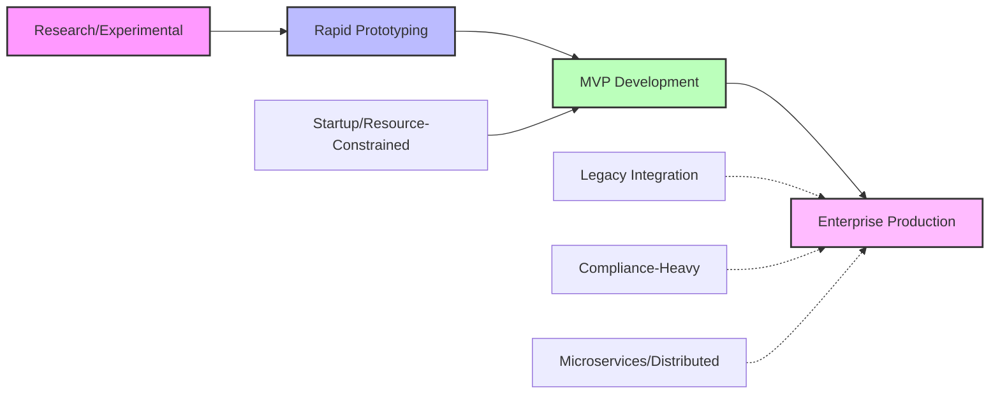

# Evolution Paths: Growing Your Prompts with Your Project

This guide shows you how to transition between prompts as your project, team, and requirements evolve.

## 🌱 The Natural Growth Cycle

Most successful projects follow predictable evolution patterns. Understanding these helps you choose the right prompt for each phase.



## 🔄 Common Evolution Paths

### Path 1: Research to Production
**Timeline:** 3-18 months  
**Context:** Academic research, R&D projects, innovative startups

```
Research/Experimental (1-4 weeks)
↓ Hypothesis validated
Rapid Prototyping (1-2 weeks)
↓ Concept proven to stakeholders
MVP Development (4-12 weeks)
↓ Users engaged, revenue potential confirmed
Enterprise Production (ongoing)
```

**Transition Triggers:**
- **Research → Prototype:** Hypothesis shows commercial potential
- **Prototype → MVP:** Stakeholders approve concept, want user version
- **MVP → Production:** Revenue/users depend on reliability

### Path 2: Startup Growth Journey
**Timeline:** 6 months - 3 years  
**Context:** Bootstrapped startups, side projects becoming businesses

```
Startup/Resource-Constrained (1-6 months)
↓ Product-market fit achieved
MVP Development (3-12 months)
↓ Revenue growth, team scaling
Enterprise Production (12+ months)
```

**Transition Triggers:**
- **Startup → MVP:** Funding raised or revenue growing consistently
- **MVP → Production:** Downtime costs real money, reputation risk

### Path 3: Enterprise Innovation
**Timeline:** 6-24 months  
**Context:** Large companies building new products/features

```
Rapid Prototyping (2-4 weeks)
↓ Executive approval secured
MVP Development (8-16 weeks)
↓ Business unit adoption
Enterprise Production (6-12 months)
```

**Transition Triggers:**
- **Prototype → MVP:** Budget approved, dedicated team assigned
- **MVP → Production:** Integration with core business systems required

## 🎯 Transition Strategies

### Upgrading Your Approach
When moving to a more rigorous prompt, don't start from scratch. Here's how to evolve:

#### From Prototype to MVP
**What to Keep:**
- Core functionality and user flow
- Basic architecture (if well-designed)
- Working features that users love

**What to Add:**
- User experience error handling
- Basic monitoring and logging
- Essential security measures
- Performance optimization for expected load

**What to Change:**
- Replace hardcoded values with configuration
- Add proper input validation
- Implement graceful degradation
- Add basic testing

#### From MVP to Enterprise
**What to Keep:**
- User-facing functionality
- Core business logic
- Database schema (usually)

**What to Add:**
- Comprehensive security audit
- Full edge case handling
- Enterprise integration capabilities
- Compliance requirements
- Advanced monitoring and alerting
- Disaster recovery procedures

**What to Change:**
- Replace "acceptable" technical debt
- Upgrade from basic to comprehensive logging
- Implement enterprise authentication/authorization
- Add formal deployment procedures

### Downgrading When Needed
Sometimes you need to move to a lighter approach:

**When to Consider Downgrading**
- **Enterprise → MVP:** Pivoting product direction, need to move faster
- **MVP → Prototype:** Testing new feature directions rapidly
- **Production → Startup:** New venture with limited resources

**How to Downgrade Safely**
- Identify non-negotiables: What standards must be maintained?
- Document technical debt: What corners can you cut temporarily?
- Set clear boundaries: When will you need to upgrade again?
- Maintain core security: Never compromise on basic security practices

## 📊 Evolution Decision Matrix

Use this matrix to decide when to evolve:

| Current State | User Count | Revenue Impact | Team Size | Recommended Evolution |
|---------------|------------|----------------|-----------|------------------------|
| Prototype     | 0-10       | None           | 1-2       | → MVP when users request it |
| MVP           | 10-1,000   | Low-Medium     | 2-5       | → Production when downtime = revenue loss |
| Production    | 1,000+     | High           | 5+        | → Microservices when scaling becomes bottleneck |

## 🚨 Evolution Warning Signs

### Signs You Need to Evolve Up

**From Prototype:**
- Stakeholders asking "when can we show this to real users?"
- Demo breaking frequently during presentations
- Requests for "just one more feature" becoming common

**From MVP:**
- Customer support tickets about reliability
- Revenue loss when system is down
- Security concerns raised by enterprise customers
- Performance degrading with user growth

**From Enterprise Single-Service:**
- Deployment of one feature blocks others
- Team coordination becoming difficult
- Different parts of system need different scaling
- Multiple services sharing same database causing conflicts

### Signs You're Evolving Too Fast

**Skipping MVP phase:**
- Building enterprise features before validating user need
- Over-engineering for hypothetical scale
- Spending months on compliance before first customer

**Over-engineering for current phase:**
- Prototype taking weeks because of enterprise considerations
- MVP including features for 1M users when you have 100
- Research project including production monitoring

## 🛠️ Practical Evolution Tips

### Managing Technical Debt During Transitions

```markdown
## Technical Debt Log
- **Acceptable Now**: Using hardcoded API keys for prototype
- **Must Fix By**: MVP launch (when we have real users)
- **Estimated Effort**: 2 days to implement proper config management
```

**Incremental Improvements:**
Don't try to upgrade everything at once. Prioritize by:
1. **User Impact**: Fix what affects users first
2. **Security Risk**: Address vulnerabilities immediately
3. **Developer Velocity**: Remove blockers to feature development
4. **Business Risk**: Handle anything that could cost money/reputation

### Team Communication During Evolution

**Set Clear Expectations:**
- "We're moving from prototype to MVP - expect 2 weeks of hardening work"
- "Enterprise evolution means 3x longer development cycles but 10x more reliability"

**Involve Stakeholders:**
- Show them the trade-offs visually
- Explain why the slower pace is necessary
- Set realistic timeline expectations

## 📈 Success Metrics by Phase

Track these metrics to know when you're ready to evolve:

**Prototype Phase**
- **Success**: Concept demonstrated successfully
- **Ready to Evolve**: Stakeholders approve real user testing

**MVP Phase**
- **Success**: Users actively using core features
- **Ready to Evolve**: Revenue/engagement depends on reliability

**Enterprise Production Phase**
- **Success**: System reliability meets SLAs
- **Ready to Evolve**: Scaling/coordination challenges emerge
